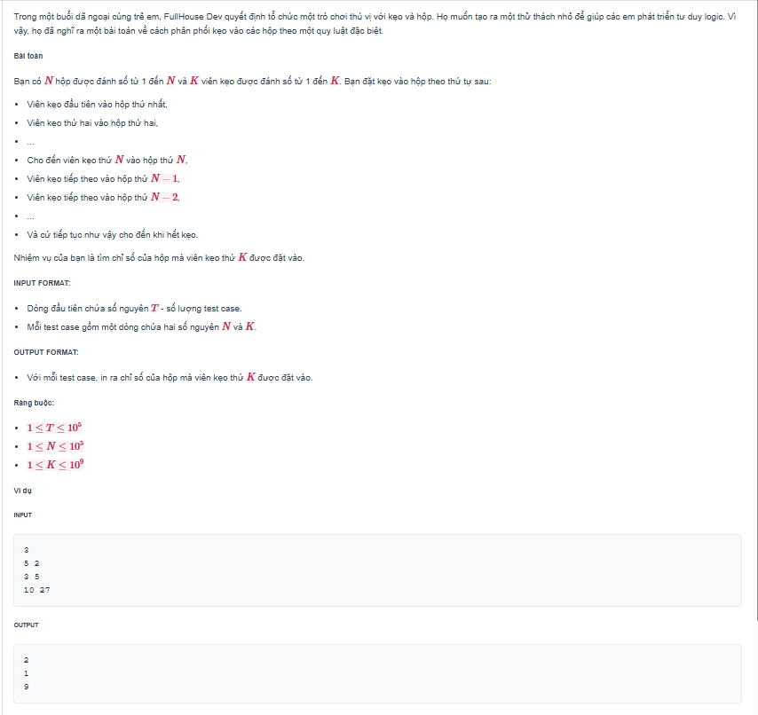

# 🍬 Bài Tập: Kẹo Trong Hộp (Candy Box)


## 📌 1. Đề bài
Nhiệm vụ là tìm chỉ số của hộp mà viên kẹo thứ **K** được đặt vào. Quy luật: bỏ vào hộp $1, 2, ..., N$ rồi ngược lại $N-1, N-2, ..., 2$ và lặp lại.



---
## 📂 Cấu trúc thư mục
- `README.md`: Hướng dẫn chi tiết.
- `solution_simulation.cpp`: Cách 1 - Mô phỏng từng bước.
- `solution_optimal.cpp`: Cách 2 - Toán học tối ưu.
- `problem.png`: Đề bài.


## 💡 2. Các phương pháp giải quyết

### 🐢 Cách 1: Mô phỏng trực tiếp (Brute-force / Simulation)
**Cách suy nghĩ:**
Làm y hệt những gì đề bài mô tả, "phát" từng viên kẹo từ $1$ đến $K$.

* **Khởi tạo:** Bắt đầu từ hộp `box = 1`.
* **Hướng đi:** Cần một biến `direction = 1` (đi lên) hoặc `-1` (đi xuống).
* **Thực hiện:** Mỗi lần bỏ 1 viên kẹo, ta tiến tới hộp tiếp theo: `box = box + direction`.
    * Nếu `box` chạm mốc $N$: đổi hướng `direction = -1`.
    * Nếu `box` chạm mốc $1$: đổi hướng `direction = 1`.
* **Lặp lại:** Thực hiện đúng $K$ lần.

**Đánh giá độ phức tạp:**
* **Thời gian:** $O(K)$ cho mỗi test case. Tổng thời gian là $O(T \times K)$.
* **Không gian:** $O(1)$.
* **Kết luận:** Với ràng buộc $T \le 10^5$ và $K \le 10^9$, số phép tính lên tới $10^{14}$. Cách này chắc chắn sẽ bị **Time Limit Exceeded (TLE)**.

---

### Cách 2: Tìm chu kỳ di chuyển (Tối ưu O(1))

Để tối ưu bài toán với $K$ lên đến $10^{18}$, ta sử dụng tính chất chu kỳ của chuyển động zigzag.

#### **Bước 1: Tính độ dài chu kỳ (C)**
Một chu kỳ hoàn chỉnh bao gồm lượt đi từ $1 \rightarrow N$ và lượt về từ $N-1$ xuống sát $1$.
- Công thức: $C = 2N - 2$.

#### **Bước 2: Tìm vị trí tương đương của viên kẹo thứ K**
Ta đưa bài toán về hệ đếm từ $0$ để sử dụng phép toán Modulo một cách chính xác nhất:
- Công thức: `index = (K - 1) % C`.
- Lúc này, `index` sẽ là số bước đi tính từ vị trí bắt đầu, luôn nằm trong khoảng $[0, C-1]$.

#### **Bước 3: Xác định số thứ tự của hộp**
Dựa vào giá trị `index`, ta xác định hướng di chuyển của viên kẹo:

1. **Lượt đi (Hướng từ 1 đến N):**
   - Điều kiện: `index < N`.
   - Vị trí hộp: $Hộp = index + 1$.

2. **Lượt về (Hướng từ N về 1):**
   - Điều kiện: `index >= N`.
   - Vị trí hộp: $Hộp = C - index + 1$.

#### **Ví dụ minh họa:**
Với $N = 5$ hộp, $K = 7$:
- $C = 2 \times 5 - 2 = 8$.
- `index = (7 - 1) % 8 = 6`.
- Vì `6 >= 5`, áp dụng công thức lượt về: $Hộp = 8 - 6 + 1 = 3$.
- **Kết quả:** Hộp số 3.
---

## 🚀 3. Hướng dẫn chạy code
1. Mở file `solution.cpp` bằng VS Code.
2. Nhấn `Ctrl + ~` mở Terminal.
3. Biên dịch và chạy:
   ```bash
   g++ solution.cpp -o solution && ./solution